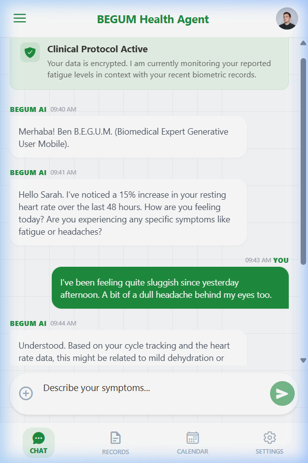
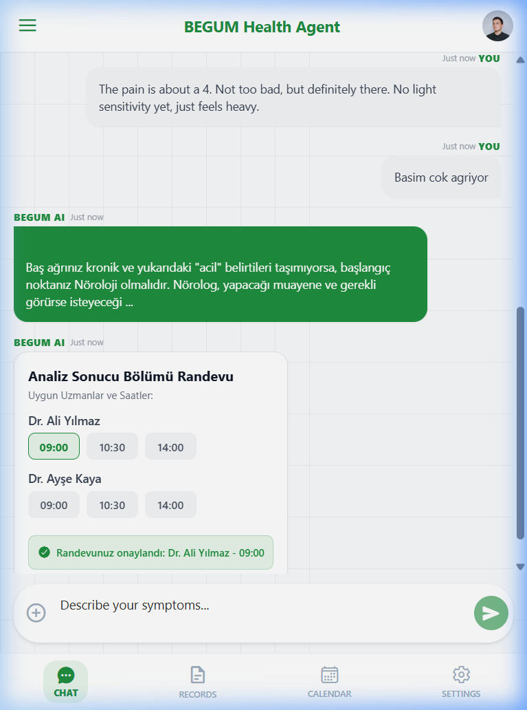

# B.E.G.U.M. Health Agent 🩺
**Biomedical Expert Generative User Mobile**

B.E.G.U.M. Health Agent, hastaların şikayetlerini analiz ederek onları en uygun tıbbi bölüme ve uzmanlık alanına yönlendiren, yapay zeka destekli bir mobil sağlık asistanıdır. Dr. Nurettin Şenyer tarafından başlatılan **NAIM Challenge** vizyonuna uygun olarak geliştirilmiştir.

---

## 🚀 Konsept ve Vizyon
Geleneksel sağlık danışmanlığının ötesinde, B.E.G.U.M. AI, kullanıcının belirttiği semptomları gerçek zamanlı internet verileriyle (Serper.dev) eşleştirerek:
- Belirtilerin hangi bölüme (Dahiliye, Nöroloji, Kardiyoloji vb.) ait olduğunu tespit eder.
- Kritik durumlarda (heart rate artışı, şiddetli ağrı vb.) kullanıcıyı uyarır.
- Sağlık verilerinin (biometric records) şifreli ve güvenli bir şekilde işlenmesini sağlar.

---

## 🛠 Teknoloji Yığını (Tech Stack)
Proje, modern ve yüksek performanslı bir mobil deneyim sunmak için en yeni teknolojileri harmanlar:

| Teknoloji | Kullanım Amacı |
| :--- | :--- |
| **React Native (Expo)** | Platformlar arası (iOS/Android) yerel mobil uygulama geliştirme. |
| **Serper.dev API** | Gerçek zamanlı tıbbi bilgi ve bölüm yönlendirmesi için Google Search entegrasyonu. |
| **Google Stitch** | UI/UX bileşenlerinin tasarımı ve tasarım sistemi (design system) yönetimi. |
| **Antigravity AI** | Kod mimarisi, mantıksal akışlar ve yapay zeka asistan geliştirme süreçleri. |

---

## ⚖️ NAIM Metrikleri (Iteration Weight)
NAIM Challenge kuralları çerçevesinde her geliştirme aşaması belirli bir "kilo" (ağırlık) ve amaçla ilişkilendirilir.

| İterasyon | Kilo (kg) | Amaç / Kazanım | Durum |
| :--- | :---: | :--- | :---: |
| v1.0 (MVP) | 15kg | Temel arayüz ve Serper.dev API entegrasyonu. | ✅ |
| v1.1 | 15kg | Dinamik bölüm yönlendirmesi ve yükleme durumu. | ✅ |
| v1.2 | 20kg | İnteraktif Randevu Kartı ve onay sistemi. | ✅ |
| v2.0 | 50kg | Tam kapsamlı yerel TFLite model entegrasyonu ve çevrimdışı analiz. | ⏳ Planlandı |

---

## ⚙️ Nasıl Çalışır? (JSON Tabanlı Render Mantığı)
Uygulama, **veri odaklı (data-driven) UI** prensibiyle çalışır. Mesajlaşma akışı tamamen JSON tabanlı bir yapı üzerinden yönetilir:

1. **Mesaj Yapısı:** Her mesaj (bot veya kullanıcı), `id`, `text`, `type` (bot/user) ve `category` alanlarını içeren bir JSON objesidir.
2. **Listeleme:** `FlatList` bileşeni, bu JSON dizisini (`messages` state) dinler ve gerçek zamanlı olarak arayüze basar.
3. **Analiz Akışı:**
   - Kullanıcı girişi alınır.
   - Serper API'ye gönderilen sorgu sonucu dönen JSON snippet'leri, `deptMap` algoritması ile işlenir.
   - Sonuç, yeni bir bot mesajı objesi olarak JSON dizisine eklenir ve UI anlık olarak güncellenir.

---

## 📸 Ekran Görüntüleri
*Mobil görünüm örneği (v1.1) ve Randevu Onay Sistemi (v1.2):*

| Ana Ekran | Randevu Onay Testi |
| :---: | :---: |
|  |  |

---

## 📥 Kurulum (Running the App)
Uygulamayı mobil cihazınızda veya web'de çalıştırmak için:

```bash
# Bağımlılıkları yükleyin
npm install

# Expo sunucusunu başlatın
npx expo start
```

*NAIM Challenge kapsamında sürekli gelişim hedeflenmektedir.*
